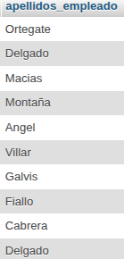
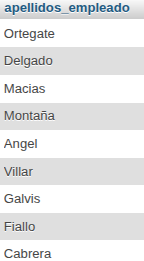
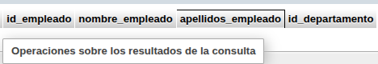
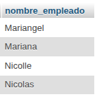
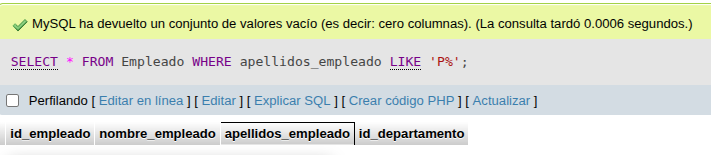
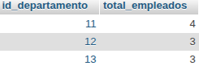
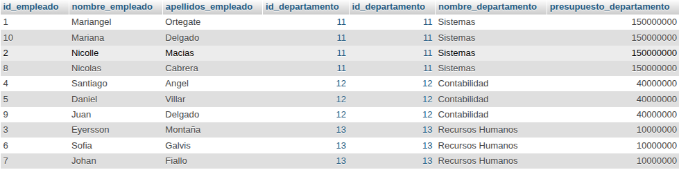
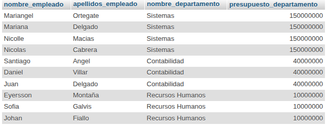
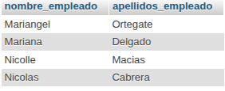
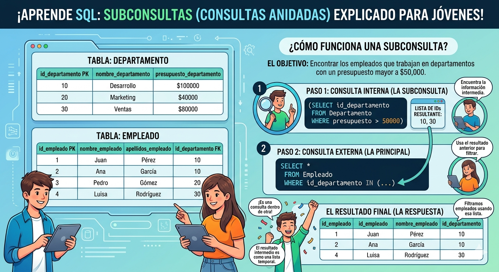

# consultas2_sql

# Base de datos

1. Obtener la lista de los apellidos de todos los empleados.

`SELECT apellidos_empleado FROM Empleado;`

2. Obtener los apellidos de todos los empleados sin repeticiones.

`SELECT DISTINCT apellidos_empleado FROM empleado;`

3. Obtener todos los datos de los empleados que se apellidan 'Gomez'.

`SELECT AVG(apellidos_empleado) AS Gomez_apellido FROM Empleado WHERE apellidos_empleado = "Gomez";`

4. Obtener todos los datos de los empleados que se apellidan "Diaz" y los que se apellidan "Rodriguez".  Usar OR o IN.

`SELECT * FROM Empleado WHERE apellidos_empleado = 'Diaz' OR apellidos_empleado = 'Rodriguez';`

5. Obtener los nombres de los empleados que trabajan en el departamento 11.

`SELECT nombre_empleado FROM Empleado WHERE id_departamento = 11;`

6. Obtener todos los datos de los empleados cuyo apellido empiece por 'P'.

`SELECT * FROM Empleado WHERE apellidos_empleado LIKE 'P%';` 

7. Obtener el presupuesto total de todos los departamentos.

`SELECT SUM(presupuesto_departamento) AS total_presupuesto FROM Departamento;` 

8. Obtener el número de empleados de cada departamento.

`SELECT id_departamento, COUNT(*) AS total_empleados FROM Empleado GROUP BY id_departamento;`

9. Obtener un listado completo de empleados, incluyendo por cada empleado los datos del empleado y de su departamento.

`SELECT * FROM Empleado e JOIN Departamento d ON e.id_departamento = d.id_departamento;`

10. Obtener un listado completo de empleados, incluyendo el nombre y apellidos del empleado junto al nombre y presupuesto de su departamento.

`SELECT e.nombre_empleado, e.apellidos_empleado, d.nombre_departamento, d.presupuesto_departamento FROM Empleado e JOIN Departamento d ON e.id_departamento = d.id_departamento;`

11. Obtener los nombres y apellidos de los empleados que trabajen en departamentos cuyo presupuesto sea mayor a 100000000.

`SELECT e.nombre_empleado, e.apellidos_empleado FROM Empleado e JOIN Departamento d ON e.id_departamento = d.id_departamento WHERE d.presupuesto_departamento > 100000000;`

# Clausula inner join

# Subconsulta

