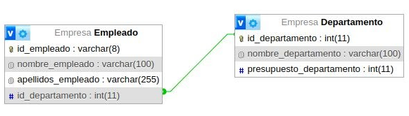
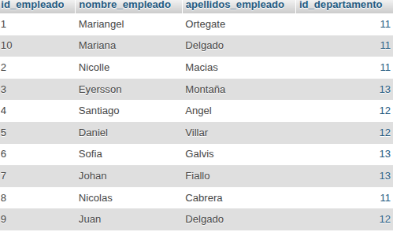

# consultas2_sql

# Base de datos

1. Obtener la lista de los apellidos de todos los empleados.

`SELECT apellidos_empleado FROM Empleado;`

2. Obtener los apellidos de todos los empleados sin repeticiones.

`SELECT DISTINCT apellidos_empleado FROM empleado;`

3. Obtener todos los datos de los empleados que se apellidan 'Gomez'.

`SELECT AVG(apellidos_empleado) AS Gomez_apellido FROM Empleado WHERE apellidos_empleado = "Gomez";`

4. Obtener todos los datos de los empleados que se apellidan "Diaz" y los que se apellidan "Rodriguez".  Usar OR o IN.

5. Obtener los nombres de los empleados que trabajan en el departamento 11.